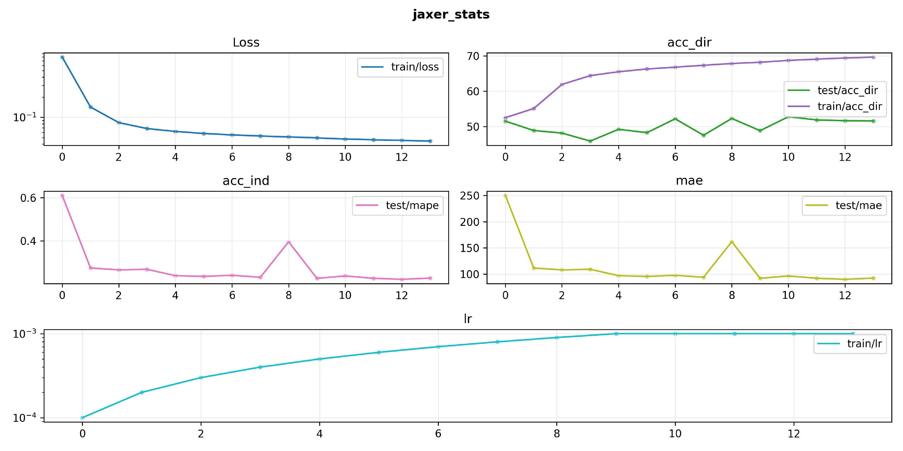
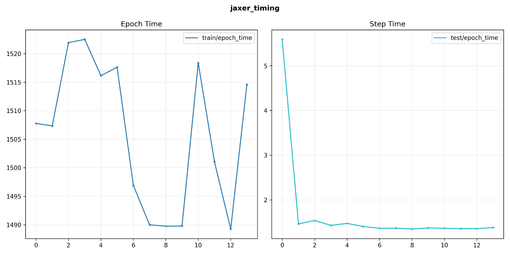

# TensorBot: Tensorboard Telegram Bot
`Tensorboard` connection to `telegram` to monitor your training process. You can monitor whatever training you want. Just need
to provide the path of the tensorboard log, some configuration for the plots of the desired metrics and a telegram
token and chat id to send messages to.


> [!NOTE]
> The goal of this project is to provide a simple and generic way to track your training process when you are not in front of your computer or server. It
> also aims to be compatible with whatever training you are doing, as long as you are using `tensorboard` to log your metrics.

## Installation
Just clone the repo and install the package with pip:
```bash
git clone https://github.com/rsanchezmo/tensorbot.git
cd tensorbot
pip install .
```

## Usage
First you should create your bot on telegram using the `BotFather` and get the token. Then you should open a chat with your bot
and write some message to it. Then you can get the chat id by calling the following url:
```python
import requests

url = f'https://api.telegram.org/bot{YOUR_TELEGRAM_TOKEN}/getUpdates'
response = requests.get(url)
print(response.json())
```
You should see the `chat: id` in the response. If you receive nothing, remember to send a message to your bot first.

There is an `example.py` file that you can run to see how `tensorbot` works. Just instantiate the `TensorBot` class with your token and chat id, 
then create your plot config as depicted below and run the bot with the `run` method.

```python
from tensorbot import TensorBot

bot = TensorBot(token='YOUR_TOKEN_ID', chat_id='YOUR_CHAT_ID')

plot_config = [
    {
        'figure_name': 'jaxer_stats',
        'fig_size': (12, 6),
        'max_cols': 2,
        'subplots': [
            {
                'tags': ['train/loss'],
                'title': 'Loss',
                'scale': 'log',
                'legend': True,
            },
            {
                'tags': ['test/acc_dir', 'train/acc_dir'],
                'title': 'acc_dir',
                'scale': 'linear',
                'legend': True
            },
            {
                'tags': ['test/mape'],
                'title': 'acc_ind',
                'scale': 'linear',
                'legend': True
            },
            {
                'tags': ['test/mae'],
                'title': 'mae',
                'scale': 'linear',
                'legend': True
            },
            {
                'tags': ['train/lr'],
                'title': 'lr',
                'scale': 'log',
                'legend': True
            }
        ]
    },
    {
        'figure_name': 'jaxer_timing',
        'fig_size': (12, 6),
        'max_cols': 2,
        'subplots': [
            {
                'tags': ['train/epoch_time'],
                'title': 'Epoch Time',
                'scale': 'linear',
                'legend': True,
            },
            {
                'tags': ['test/epoch_time'],
                'title': 'Step Time',
                'scale': 'linear',
                'legend': True
            }

        ]
    }
]

bot.run(experiment_name='my_exp', update_interval=1, patience_time=30, plot_config=plot_config,
        tensorboard_path='YOUR_TENSORBOARD_PATH')
```

To finish the process, just press `Ctrl+C` in the terminal where you are running the script or the process will
stop after the `patience_time` minutes you set in the `run` method.

You should receive messages like this:
```
- TensorBot started to monitor experiment: my_exp 🚀 
- Checking for updates every 1 minutes

- Experiment: my_exp updated! 🚀
- Training time: 5.44 hours
- Training steps: 13
```



 
Yes, you can see what overfitting is on this training 🤣🤣 This is one of my experiments of a personal project about training a foundational transformer model in `jax/flax` 
for timeseries forecasting. I am working with real cryptocurrency and synthetic data. You can go to my `jaxer` [repo](https://github.com/rsanchezmo/jaxer) to see more about this project.

> [!NOTE]
> You can customize the plots as you want! If you think some feature is missing, open an issue and let me know!


## Contributors
Rodrigo Sánchez Molina

- Email: rsanchezm98@gmail.com
- Linkedin: [rsanchezm98](https://www.linkedin.com/in/rsanchezm98/)
- Github: [rsanchezmo](https://github.com/rsanchezmo)

## Citation
If you find `tensorbot` useful, please consider citing:

```bibtex
  @misc{2024tensorbot,
    title     = {TensorBot: Tensorboard Telegram Bot},
    author    = {Rodrigo Sánchez Molina},
    year      = {2024},
    howpublished = {https://github.com/rsanchezmo/tensorbot}
  }
```